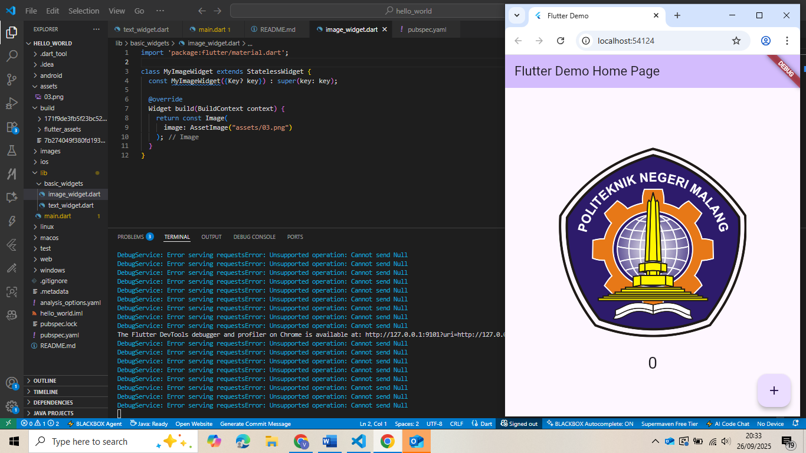
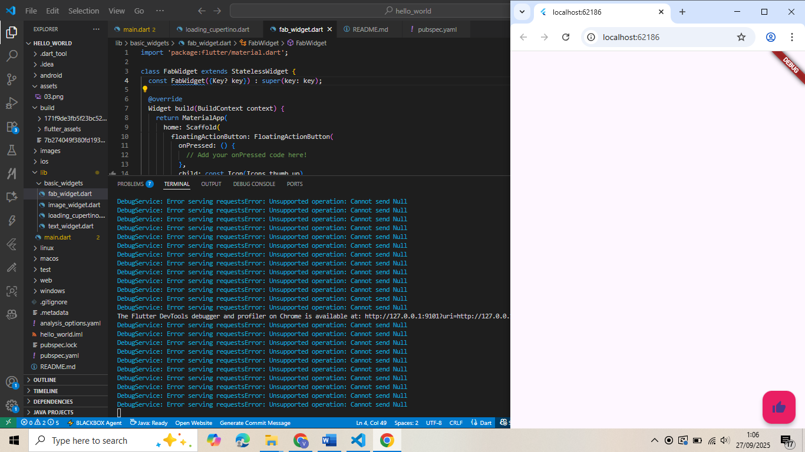
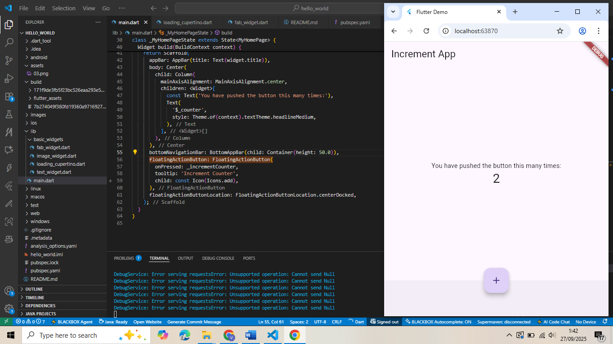
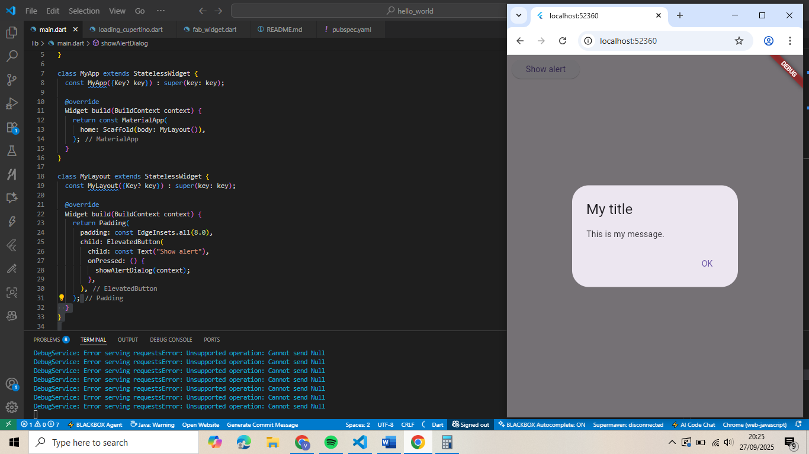
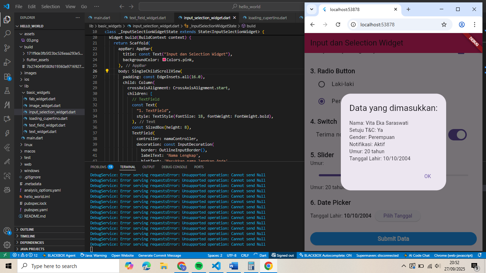
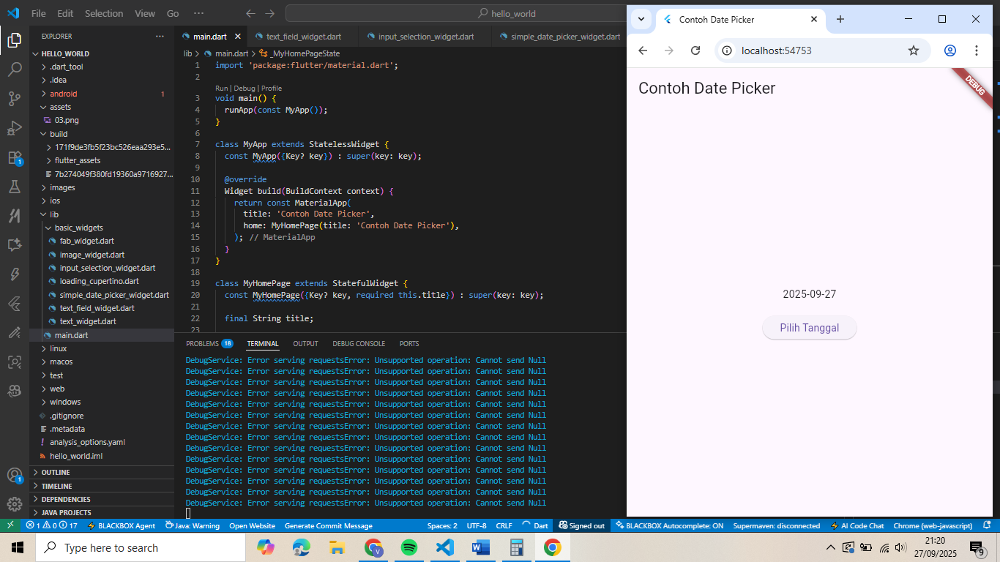

# Hello World - Flutter Project

A new Flutter project.

Mata Kuliah : Pemrograman Mobile  

Nama       : Vita Eka Saraswati  
Kelas      : SIB 3D  
No Absen   : 29  

---

## Praktikum 3
**Langkah 12 : Hello World**  

---

## Praktikum 4
**Langkah 1 : Text Widget**  

**Langkah 3 : Image Widget**  

---

## Praktikum 5
**Langkah 2 : Button Widget** 

**Langkah 3 : Scaffold Widget**

**Langkah 4 : Dialog Widget** 

**Langkah 5 : Input & text field widget** 

**Langkah 6 : Date pickers widget** 

