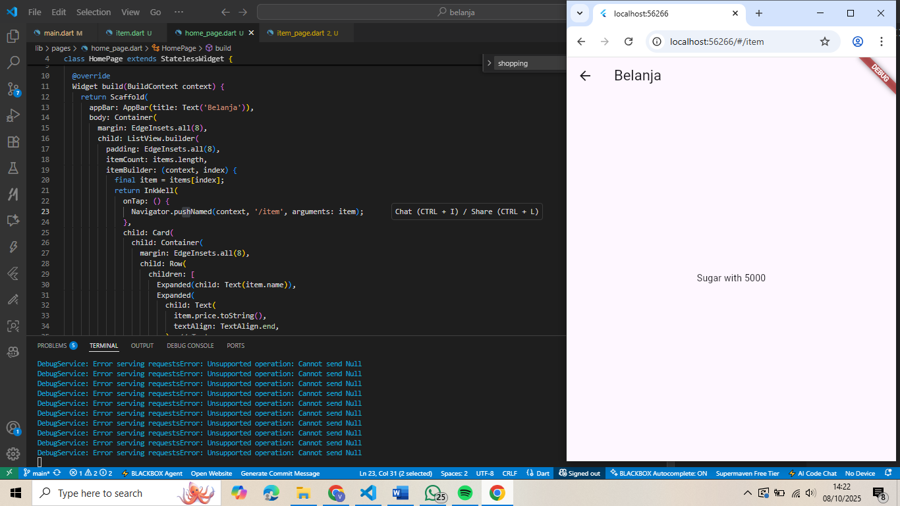
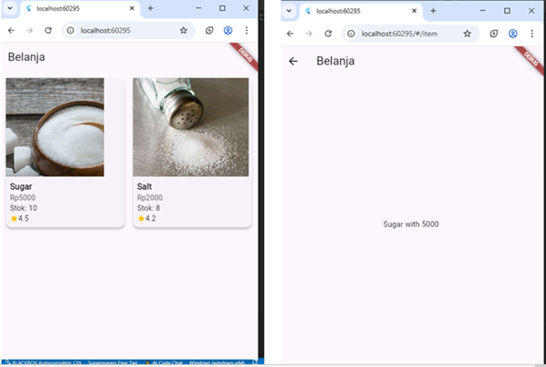
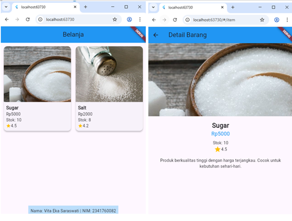
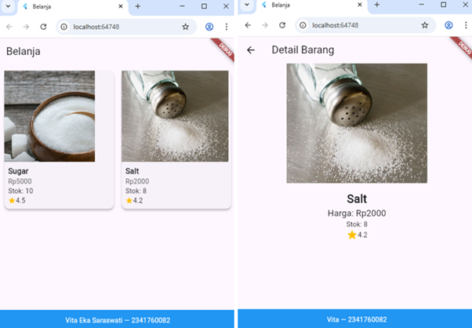

# Layout & Navigasi - Flutter Project (JS5 Praktikum 5)

A new Flutter project.

Mata Kuliah : Pemrograman Mobile Week 5

Nama       : Vita Eka Saraswati  
Kelas      : SIB 3D  
No Absen   : 29  

---

## Praktikum 5
**Navigasi di Flutter**

---

## Tugas Praktikum 2
**Soal 3 : Menambahkan  atribut foto produk, stok, dan rating dan merubah tampilan menjadi GridView**

---

**Soal 4 & 5 : Implementasi HeroWidget & Footer**

---

**Soal 6 : Implementasi Go Router**

