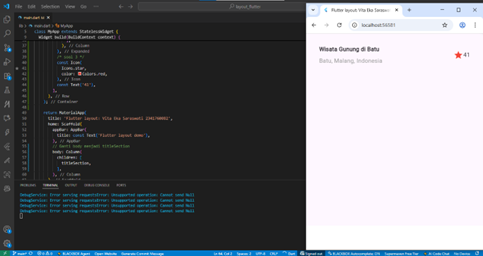
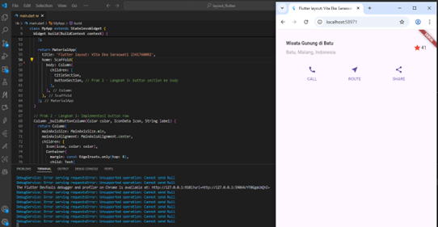
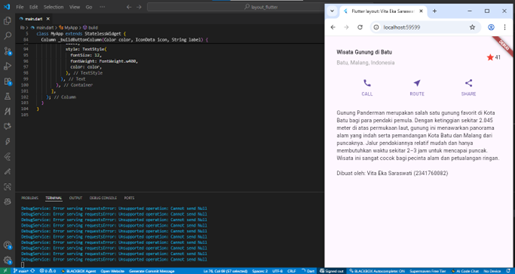
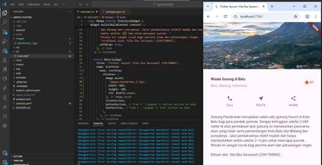

# Layout & Navigasi - Flutter Project

A new Flutter project.

Mata Kuliah : Pemrograman Mobile Week 5

Nama       : Vita Eka Saraswati  
Kelas      : SIB 3D  
No Absen   : 29  

---

## Praktikum 1
**Layout di Flutter**

---

## Praktikum 2
**Implementasi button row**

---

## Praktikum 3
**Implementasi textSection**

---

## Praktikum 4
**Implementasi imageSection**

---